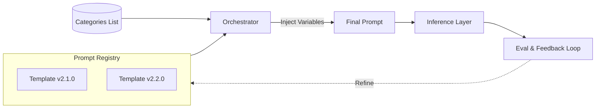

### 1. Introduction to LLMOps

**1. What LLMOps is and why it matters**

LLMOps extends MLOps to manage the full lifecycle of large language models (LLMs) and LLM-powered applications in production. It covers prompt engineering, chaining/orchestration, retrieval (e.g., RAG), fine-tuning, deployment, observability, and continuous iteration.

**Why it matters** — LLMs introduce non-deterministic outputs, high inference costs, hallucinations, prompt sensitivity, and rapid model/provider changes. Without LLMOps, prototypes fail at scale due to drift, cost overruns, poor reliability, and compliance risks.

**2. How LLMOps differs from traditional MLOps**

| Aspect              | Traditional MLOps                                      | LLMOps                                                                 |
|---------------------|--------------------------------------------------------|------------------------------------------------------------------------|
| Primary Focus       | Training from scratch, structured data                 | Inference-heavy, prompt/RAG optimization, foundation models             |
| Key Artifacts       | Datasets, features, model weights                      | Prompts, chains, embeddings, vector indexes, guardrails                 |
| Evaluation          | Fixed metrics (Accuracy, F1, AUC)                      | Human-in-loop, LLM-as-judge, semantic similarity, hallucination checks  |
| Cost Driver         | Training compute                                       | Inference tokens + latency                                              |
| Iteration Speed     | Slow (retrain cycles)                                  | Fast (prompt tweaks, few-shot/RAG updates)                              |
| Non-determinism     | Predictable                                            | High (temperature, sampling, model updates)                             |
| Monitoring Needs    | Drift in features/labels                               | Prompt drift, output quality, bias/toxicity, cost per query             |

LLMOps adds layers for prompt versioning, chain tracing, and ethical alignment.

**3. Real-world use cases requiring LLMOps**

**Customer support chatbots** — Banks/enterprises (e.g., using GPT-4 + RAG) face latency, regulatory compliance, hallucination in domain-specific answers.

**Internal knowledge assistants** — Companies like Thomson Reuters or BNY Mellon deploy RAG-based tools for employee Q&A, needing versioning and monitoring for accuracy.

**Content moderation/toxicity detection** — Gaming firms fine-tune LLMs, requiring ongoing eval and drift detection.

**Investment platforms** — BlackRock's Aladdin Copilot uses agentic flows (LangChain) for financial workflows, demanding auditability and low hallucination.

**Voice-enabled agents** — Real-time apps (e.g., with Deepgram + LangChain) need sub-second latency and memory management.

**4. Challenges unique to LLM systems in production**

Non-deterministic behavior → hallucinations, inconsistent outputs.

Prompt brittleness → small changes break performance.

High/variable costs → token-based pricing, runaway queries.

Evaluation difficulty → no single ground-truth metric; needs human/LLM judges.

Data freshness/security → RAG sources drift or leak.

Provider/model volatility → API changes, deprecations.

Latency/scalability → GPU inference, chain complexity.

Ethical/safety risks → bias, toxicity, jailbreaks.

**LLMOps End-to-End Pipeline**

[Raw Data / User Queries]  
↓  
[Data Preparation + Vector DB Indexing]  
→ Embeddings  
→ Vector Store (Pinecone / Chroma)  
↓  
[Prompt Engineering & Versioning]  
→ Prompt Registry (PromptLayer / Git / Database)  
↓  
[Orchestration Layer]  
→ LangChain / LlamaIndex chains  
→ RAG / Agents / Tools  
↓  
[Inference]  
→ OpenAI / Anthropic / Groq  
→ Self-hosted (vLLM / Ray Serve)  
↓  
[Tracing & Logging]  
→ LangSmith / Helicone / Phoenix  
→ Metrics: latency, tokens, cost  
↓  
[Evaluation & Feedback]  
→ Human evaluation  
→ LLM-as-Judge  
→ Automated metrics  
→ Evaluation dataset

↓ **(Feedback Loop)**  
[Refinement & Redeployment]  
→ Prompt updates / RAG tuning / Fine-tuning / Guardrails  
→ Deploy new version (A/B testing, canary release)

**5. High-level scalable LLMOps pipeline (foundations → build → deploy → observe → scale)**

**Foundations**

Select base model/provider.

Set up observability early (Helicone/LangSmith for tracing).

Version control: Git for code/prompts; prompt registry tool.

**Build**

Prompt management: Store/test/version prompts (PromptLayer style).

Build chains/pipelines: LangChain/LlamaIndex for RAG, agents, tools.

RAG setup: Chunk → Embed → Retrieve → Augment prompt.

Evaluation harness: Build test sets, run batch eval, track metrics.

**Deploy**

Serving: API endpoints (FastAPI + vLLM for self-hosted, or provider APIs).

Scaling: Auto-scaling GPUs, caching (Redis for prompts/responses).

Guardrails: Input/output filters (toxicity, PII).

Rollout: A/B testing, canary releases.

**Observe**

Metrics: Latency, token cost/query, success rate, hallucination score.

Tracing: Full chain traces, retrieval relevance.

Alerts: Drift detection, cost spikes, quality drops.

Human feedback loop: Thumbs up/down → retrain prompts/

**Scale**

Cost optimization: Model distillation, batch inference, caching.

Multi-model routing: Fallbacks, cheaper models for simple queries.

Continuous iteration: CI/CD for prompts/chains (GitHub Actions).

Enterprise: Compliance logging, RBAC, audit trails.

**Real-world example stack (e.g., enterprise RAG chatbot):**

LangChain/LangGraph → Pinecone → OpenAI → Helicone tracing → LangSmith eval → Kubernetes/Ray Serve deployment → Prometheus alerts.

This structure ensures reproducibility, reliability, and cost control while enabling fast iteration on prompts and retrieval. Implement tracing from day one—it pays off immediately in debugging production issues.

### 2. Architecture of an LLMOps

**High-level LLMOps system architecture**

Modern LLMOps architecture is modular, layered, and feedback-driven. It separates concerns for fast iteration on prompts/RAG while maintaining production-grade reliability, cost control, and observability.

**Layered reference architecture**

### 3. Layered LLM System Architecture

[User / Application Layer]  
→ API Gateway / Frontend  
→ FastAPI / Streamlit / Next.js  
↓  

[Orchestration & Logic Layer]  
→ Chains / Agents / Workflows  
→ LangGraph / LlamaIndex / Haystack  
↓  

[Retrieval & Augmentation Layer]  
→ Embeddings + Vector Database  
→ Pinecone / Weaviate / Chroma / PGVector  
↓  

[Inference & Serving Layer]  
→ LLM Backend  
→ OpenAI / Anthropic / Groq  
→ Self-hosted: vLLM / TGI / Ray Serve  
↓  

[Observability & Evaluation Layer]  
→ Tracing: LangSmith / Helicone / Phoenix / OpenLLMetry  
→ Evaluation: Human review / LLM-as-judge / Automated metrics  
→ Dashboards: Cost, Latency, Output Quality  
↓  

**Feedback Loop**  
→ Prompt refinement  
→ RAG tuning  
→ Fine-tuning  
→ CI/CD-based iteration an

**Core principle:** Everything is versioned and traceable — prompts, chains, embeddings, indexes, model versions.

**Deployment pattern:** GitOps + CI/CD (GitHub Actions / ArgoCD) for reproducible rollouts (A/B, canary).

**Scaling levers:** Model routing (cheap/fast vs expensive/accurate), response caching (Redis), batch inference.

**Core components of an LLMOps pipeline**

| Component              | Purpose                                              | Typical Tools / Implementations                                  | Engineering Notes                                                                 |
|------------------------|------------------------------------------------------|------------------------------------------------------------------|-----------------------------------------------------------------------------------|
| Prompt Registry        | Version, test, and A/B prompts & templates           | PromptLayer, LangSmith Hub, Git + DB                              | Semantic diffing, playground testing, prompt lineage                               |
| Embedding Pipeline     | Chunk, embed, and index documents for RAG            | Sentence Transformers, OpenAI Embeddings, Cohere                 | Batch jobs, incremental indexing, rich metadata                                    |
| Vector Store           | Fast similarity search for context retrieval          | Pinecone, Weaviate, Qdrant, Chroma, PGVector                     | Hybrid search, reranking, metadata filtering                                       |
| Orchestration Engine   | Compose chains, agents, tools, and memory             | LangGraph, LlamaIndex Workflows, CrewAI                          | Graph-based execution, branching logic, retries                                     |
| Inference Gateway      | Route, fallback, rate-limit, and cache LLM calls     | LiteLLM, Portkey, Helicone, OpenRouter                           | Multi-provider abstraction, cost and usage tracking                                 |
| Serving Infrastructure | Low-latency, scalable model hosting                  | vLLM, TGI, Ray Serve, Kubernetes + GPU autoscaling               | Quantization (AWQ/GPTQ), continuous batching                                        |
| Evaluation Harness     | Offline and online quality assessment                | DeepEval, RAGAS, LangSmith Datasets, custom LLM judges           | G-Eval, faithfulness, answer relevance metrics                                      |
| Tracing & Monitoring   | Full request tracing, tokens, latency, errors        | LangSmith, Phoenix, Helicone, OpenTelemetry                      | Spans for chains, retrieval scores, alerts                                          |
| Feedback & Iteration   | Collect feedback and refine system behavior          | Human-in-the-loop, RLHF-lite (DPO), auto-correction pipelines    | Active learning datasets from production failures                                   |
| Guardrails & Safety    | Input/output filtering and policy enforcement        | NeMo Guardrails, Llama Guard, Patronus                           | Pre/post filters, circuit breakers, PII redaction                                   |

**Data flow from user input to model output**

**Typical production RAG + agent flow**

**LLM Request Processing Flow (RAG + Guardrails)**

User Query  
→ API Gateway  
↓  

[Input Guardrails]  
→ Validate input  
→ Sanitize content  
→ Classify user intent  
↓  

[Orchestrator]  
→ Route request (simple Q&A / agent / tool use)  
↓  

[Retrieval Step – optional]  
→ Embed user query  
→ Query Vector Database  
→ Retrieve top-k chunks  
→ Rerank results  
→ Augment prompt with retrieved context  
↓  

[Prompt Assembly]  
→ Load versioned prompt template  
→ Add few-shot examples  
→ Inject conversation history  
→ Inject retrieved context  
↓  

[LLM Inference]  
→ Call model with parameters  
  - temperature  
  - max tokens  
  - tool/function schema  
↓  

[Output Guardrails]  
→ Hallucination detection  
→ Toxicity filtering  
→ PII checks  
→ Block, rewrite, or pass response

**Latency-critical path:** Retrieval + inference dominates (target < 2–3 s for chat).

**Cost driver:** Retrieval calls + prompt tokens + generation tokens.

**Stateless vs Stateful LLM Applications**

| Aspect              | Stateless LLM Applications                                   | Stateful LLM Applications                                                     |
|---------------------|--------------------------------------------------------------|-------------------------------------------------------------------------------|
| Context Handling    | No memory between requests; full history sent every call     | Retains conversation memory, user profile, or session state                   |
| Implementation      | Each API call is independent; context passed explicitly      | Backend-managed state (Redis, DB, in-memory KV cache, GPU KV cache)            |
| Scalability         | Trivial horizontal scaling; any pod can handle any request   | Harder — requires session stickiness, affinity, or distributed state handling |
| Latency / Cost      | Higher token usage due to resending history; simpler caching | Lower token usage via prefix/KV caching; faster follow-up responses            |
| Use Cases           | One-shot Q&A, batch inference, simple RAG search             | Chatbots, multi-turn agents, personalized assistants, long workflows          |
| Engineering Trade-off| Simpler operations, easy A/B testing, no state sync issues  | Better UX, but needs eviction policies, consistency guarantees, and backups    |
| Real-world Pattern  | Most v1 chat UIs, stateless RAG endpoints                    | Memory via LangChain/LangGraph, Mem0, Upstash Redis, or stateful serving (e.g., vLLM prefix caching) |

Pure model inference is always stateless (fixed weights), but application-level state makes or breaks user experience in conversational/agentic systems. Start stateless for MVP → add state (conversation summary + vector memory) when multi-turn coherence becomes critical.

**3. Model Selection and Strategy**

As of early February 2026, the LLM landscape has matured significantly: proprietary frontier models maintain a narrow lead in general conversational quality and multimodal tasks, while open-source models have closed the gap to within 3–6 months of parity in reasoning, coding, agentic workflows, and cost-efficiency. Crowdsourced benchmarks like LMArena (formerly LMSYS Chatbot Arena) show hybrid MoE architectures dominating, with test-time compute (chain-of-thought, tool use) becoming table stakes.

**Choosing between proprietary and open-source LLMs**

**Proprietary models** (OpenAI GPT-5 series, Anthropic Claude 4 family, Google Gemini 3/3 Pro) offer the highest out-of-the-box performance for complex, multi-turn reasoning, safety alignment, and multimodal (text+image+audio) tasks. They excel when speed-to-production matters, APIs are reliable, and you accept vendor dependency. Real-world examples: Financial institutions use Claude 4 Opus for regulatory-compliant contract analysis (strong refusal rates, low hallucination); consumer apps route to GPT-5 for empathetic chat (highest LMArena Elo in general chat).

**Open-source models** (DeepSeek-V3.2, Qwen3-235B, GLM-4.7, Kimi-K2, Llama 4 Scout/Maverick, gpt-oss-120B) provide full control over weights, inference, and fine-tuning. They lead or match proprietary in specialized domains like coding (DeepSeek-V3.2-Speciale > GPT-5 on AIME/HMMT), agentic tasks (GLM-4.7, MiniMax-M2.1), and cost-sensitive high-throughput (MiMo-V2-Flash at 150 t/s). Enterprises choose open-source for data sovereignty (self-hosting avoids API data exfiltration), unlimited usage, and domain adaptation (fine-tune on internal docs). Example: Healthcare firms deploy fine-tuned Llama 4 variants on-premises for PHI compliance; coding platforms use DeepSeek-V3.2 for agentic code generation at 5–10× lower cost.

**Decision framework**

Choose proprietary if: You need the absolute best generalist today, multimodal is core, or compliance teams demand vendor SLAs.
Choose open-source if: Privacy/control is non-negotiable, you need heavy customization, or inference costs dominate at scale.
Hybrid is most common: Proprietary for high-stakes queries, open-source for volume/simple tasks.

**Trade-offs: Performance, Cost, Latency, and Control**

| Aspect | Proprietary Models (e.g., GPT-5.2, Claude 4 Sonnet, Gemini 3 Pro) | Open-Source Models (e.g., DeepSeek-V3.2, Qwen3-235B, Llama 4 Maverick) | Engineering Implications (2026) |
|------|------------------------------------------------------------------|---------------------------------------------------------------------|--------------------------------|
| Performance | Top 3–5 on LMArena Elo (~1350–1400+); strong in general chat, multimodal, and long-context reliability (1M+ tokens stable) | Close parity or leadership in reasoning, coding, and agentic tasks (e.g., DeepSeek > GPT-5 on math; GLM-4.7 matches GPT-5 on tool use); multimodal gap narrowing | Use LMArena plus domain-specific evals (GPQA, AIME, LiveCodeBench); open-source often wins on custom benchmarks after fine-tuning |
| Cost | ~$1.25–$15 input / ~$8–$75 output per million tokens; reasoning models (o-series) 5–10× higher | Hosted: ~$0.07–$0.38 input / ~$0.38–$2 output; self-hosted: ~$0.01–$0.10 effective (GPU amortized) | 50–90% cost savings when self-hosting at scale (>10M tokens/day); proprietary cheaper for bursty or low-volume workloads |
| Latency | API: ~300–800 ms TTFT, ~50–120 tokens/sec output; variability under load | Self-hosted (vLLM/SGLang): ~50–200 ms TTFT, 100–200+ tokens/sec (quantized MoE); hosted (Groq/Fireworks): less than 100 ms TTFT | Prefix caching and continuous batching are critical; open-source excels for high-throughput agent workloads |
| Control | Black-box models; limited fine-tuning (OpenAI supports, Anthropic minimal); strong built-in safety | Full weight access; fine-tuning (LoRA/DPO), quantization (AWQ/INT4), distillation, pruning; no usage caps | Open-source enables PBAC, custom alignment, and auditability; proprietary wins on safety-by-default |
| Other | Vendor SLAs, auto-updates, easy scaling; risk of deprecation or rate limits | Rapid community iteration; hardware dependency (A100/H100 clusters); manual safety alignment | Common pattern: proprietary for MVPs, open-source for production at scale (many enterprises shifting open-source by late 2026) |

**Multi-model and fallback strategies**

Production systems route queries to the optimal model per request to balance quality, cost, and reliability. Key patterns:

**Query classification routing:** Intent classifier (small model like Phi-3 or Gemma-2) tags query as simple/medium/hard → route cheap/fast (Gemini Flash, Haiku) vs expensive/accurate (GPT-5, Claude 4 Opus).

**Semantic/cost-aware routing:** Embed query → match against historical success/cost → select model (e.g., DeepSeek for coding, Qwen for multilingual, Claude for safety-sensitive).

**Fallback chain:** Primary (best quality) → fallback (cheaper/same-provider) → last-resort (fastest/self-hosted) on timeout/error. Example: GPT-5.2 → GPT-5-mini → DeepSeek-V3.2.
A/B or shadow testing: Route 10–20% traffic to candidate model; compare live metrics (user thumbs-up, latency, cost).

**Implementation:** Use gateways like TrueFoundry, LiteLLM, Helicone, or Bifrost for unified API + routing rules (YAML or code-based). Add circuit breakers for provider outages.

**Routing logic**

```python
if query_complexity == "simple" or token_estimate < 1k:
    return route_to("gemini-2.0-flash-lite")  # $0.075/$0.30
elif contains_code_or_math():
    return route_to("deepseek-v3.2")  # high coding accuracy, low cost
elif safety_critical (e.g., finance/legal):
    return route_to("claude-sonnet-4")  # strong refusal/alignment
else:
    return route_to("gpt-5.2")  # generalist best

on failure:
    fallback_to("qwen3-235b-hosted")  # open-source parity
```

**Versioning LLMs across environments**

Versioning prevents drift between dev/staging/prod and enables safe rollouts.

**Proprietary:** Pin specific snapshots (e.g., gpt-4o-2025-11-20, )atest" in prod. Use shadow deployments to test new versions.

**Open-source:** Pin exact weights hash/commit (e.g., Hugging Face repo + revision: deepseek-ai/DeepSeek-V3-0324:abcdef). Use model registries (MLflow, Hugging Face Hub) for metadata.

**Environment strategy:**

**Dev/experiment:** Latest or bleeding-edge (test new releases quickly).

**Staging:** Mirror prod version + candidate (A/B test).

**Prod:** Fixed pin with canary rollout (5% traffic to new version → monitor quality/cost → full rollout).

**Tools:** Git for config/prompts, Helm/Kustomize for infra, Argo Rollouts for canaries. Track in observability (Langfuse/Lunary tags traces with model version).

**Upgrade cadence:** Quarterly for proprietary (test in staging 2–4 weeks); monthly for open-source (community pace fast, but validate on eval set).

**Key practice:** Always include model version + provider in every trace/log. This enables root-cause on sudden quality drops (e.g., "Claude 4.5 update increased hallucinations 15%—rollback to pinned version").

**Prompt Engineering Fundamentals**

Prompt engineering remains a core skill in LLMOps, even as models grow stronger in reasoning (e.g., hidden CoT in o-series, reasoning_effort params in frontier models). Currently, the best prompts are concise, structured, and versioned like code—leveraging templates, few-shot examples for consistency, and explicit constraints to minimize hallucinations and token waste.

**Role of prompts in LLM behavior**

Prompts act as the primary runtime control surface for LLMs. They condition the model's next-token prediction by providing:

**Task specification** — what to do (classify, generate, reason, extract).

**Contextual alignment** — who the model "is" (persona/role), audience, tone, constraints.

**In-context learning** — examples that demonstrate patterns (zero/few-shot).

**Reasoning scaffolding** — step-by-step instructions, delimiters, output formats.

Safety/quality guardrails — refusal triggers, citation requirements, uncertainty signaling.

**Key insight:**
 Modern models (GPT-5 series, Claude 4, Gemini 3, DeepSeek-V3.2, Llama 4) are heavily instruction-tuned via RLHF/DPO, so prompts shape behavior more predictably than in 2023–2024. A well-crafted prompt can close 80–90% of the quality gap between base and fine-tuned models for many tasks, at near-zero cost compared to fine-tuning.

**Real-world impact:**

Bad prompt → inconsistent tone, hallucinations, verbose outputs, missed constraints.
Good prompt → reliable format (JSON, markdown), low hallucination, cost-efficient tokens, better multi-turn coherence.

Prompts are non-deterministic influencers: small wording changes (±5–10 tokens) can swing accuracy 15–40% on benchmarks like GPQA or agentic tasks.

**14. Prompt design principles**

Core engineering-focused principles that hold across 2026 models:

(a)**Clarity and specificity first** — Eliminate ambiguity. Use precise verbs ("extract", "classify", "summarize in 3 bullets") over vague ones ("tell me about").

(b) **Structure over prose** — Organize with delimiters (###, ---, XML tags), numbered steps, bullet constraints. Models parse structured input better.

(c) **Role + Task + Context + Format + Constraints** — Universal template skeleton (works on GPT-5, Claude 4, Gemini 3, open models).

(d) **Affirmative directives** — Prefer "do X" / "always include Y" over negatives ("don't do Z" — models sometimes ignore negations).

(e) **Output format enforcement** — Specify exact schema (JSON keys, markdown headers) + "Respond only with..." to prevent chit-chat.

(f) **Chain explicit reasoning when needed** — For complex logic: "Think step by step" or "reasoning_effort: High" (if model supports). Skip for reasoning models (o3/o4-mini) where internal CoT is automatic.

(g) **Iterate with eval** — Test on 20–50 held-out examples; track metrics (exact match, semantic similarity, human thumbs).

(h) **Token efficiency** — Short prompts win at scale; use few-shot sparingly, summarize context.

(i) **Model-aware tweaks** — Claude prefers XML tags; reasoning models dislike forced CoT; open models benefit from longer examples.

**Prompt templates and parameterization**

Templates turn prompts into reusable, versioned components. Parameterize with placeholders (f-strings, Jinja, mustache) for dynamic insertion (user query, retrieved context, few-shot examples).

**Core template structure**

```mermaid
graph TD
    subgraph User_Layer [User / Application Layer]
        A[User Query] --> B[API Gateway: FastAPI/Next.js] [cite: 118, 120, 161, 162]
    end

    subgraph Security [Guardrails]
        B --> C{Input Guardrails} [cite: 164]
        C -->|Sanitize| D[Orchestrator] [cite: 166, 173]
    end

    subgraph Logic_Layer [Orchestration & Retrieval]
        D --> E[Vector DB: Pinecone/Chroma] [cite: 50, 128, 177]
        E --> F[Prompt Assembly: Versioned Templates] [cite: 182, 183]
    end

    subgraph Inference_Layer [Inference & Serving]
        F --> G[LLM: OpenAI/Anthropic/vLLM] [cite: 61, 62, 131, 133]
    end

    subgraph Feedback_Loop [Observability & Eval]
        G --> H[Tracing: LangSmith/Helicone] [cite: 65, 79, 135]
        H --> I[Evaluation: LLM-as-Judge] [cite: 69, 136]
        I -->|Refine| F [cite: 74, 111, 144]
    end

    G --> J[Output Guardrails] [cite: 194]
    J --> K[User Response] [cite: 198]
```

**Best practises**

Store in registry (Langfuse Prompt Mgmt, Lunary, Git + YAML, PromptLayer).

Version semantically (v1.2: added CoVe step).

Parameterize everything variable: role, task, format, examples count.

Use delimiters consistently (triple quotes, ```json)

Test parameterization: inject edge cases (long context, adversarial input).

CI/CD integration: lint prompts, run eval suite on change.

```python
prompt_template = """
You are a precise support ticket classifier.

Task: Classify the ticket into one category only.

Categories: billing, technical, feature_request, account, other.

Input ticket:
{user_message}

Output JSON only:
{{
  "category": "billing" | "technical" | ... ,
  "confidence": 0.0-1.0,
  "reason": "brief explanation"
}}
"""
```
**Few-Shot vs Zero-Shot Prompting**

| Aspect | Zero-Shot Prompting | Few-Shot Prompting (1–5 examples) |
|------|---------------------|-----------------------------------|
| Definition | No examples provided; relies purely on instructions and context | Includes 1–5 input–output examples demonstrating pattern, format, or reasoning |
| Token Cost | Lowest due to short prompts | Higher; examples can add ~200–1000+ tokens |
| When to Use | Simple, well-known tasks (summarization, translation, generic classification); works best with instruction-tuned models (Claude 4, GPT-5, Gemini 3) | Complex formatting, specific tone, rare patterns, stepwise reasoning, or consistency-critical outputs (JSON schemas, tables, agent steps) |
| Performance | Fast and reliable for broad tasks; struggles with nuance or strict formatting | Typically yields 10–40% accuracy improvement on difficult tasks via in-context learning |
| Reliability | Variable on out-of-distribution tasks | More consistent; examples can override model pretraining biases |
| Engineering Trade-off | Rapid iteration and low cost; limited control over structure | Higher latency and cost; strong standardization for production systems |
| 2026 Nuance | Advanced reasoning models (e.g., o3, o4-mini) often approach few-shot quality in zero-shot mode due to internal reasoning capabilities | Best practice is 2–4 diverse, high-quality examples; ordering matters, and negative examples help with refusal and toxicity control |

**Decision heuristic:**

Start zero-shot → if output drifts (wrong format, hallucinations), add 1–3 few-shot examples.

For agents/tools: few-shot almost mandatory (shows tool-call format).

For reasoning models: lean zero-shot + "reasoning_effort: High" > forced few-shot CoT.

**Real-world pattern**

Zero-shot for simple retrieval-augmented Q&A.

Few-shot for structured extraction (e.g., invoice parsing: show 3 example JSONs).

Combine: zero-shot system prompt + few-shot user examples in chat history.

### 4. Prompt Management at Scale

Prompts are treated as first-class, versioned artifacts in mature LLMOps pipelines — equivalent to code or configuration. Poor prompt management causes silent regressions, inconsistent behavior across teams/environments, and wasted debugging time. At scale (hundreds of prompts, dozens of teams, production traffic in millions of tokens/day), you need systematic versioning, traceability, and safe deployment practices.

**Prompt versioning strategies**

Prompts evolve frequently (wording tweaks, added examples, format changes, new constraints). Versioning strategies balance speed of iteration with production stability.

### 5. Prompt Versioning Strategies 

| Strategy | Description | Best For | Drawbacks / When to Avoid | Typical Tools (2026) |
|--------|-------------|----------|----------------------------|---------------------|
| Semantic Versioning (SemVer) | Major.Minor.Patch scheme: major = breaking change (format/schema), minor = behavioral improvement, patch = typo or small fix | Most production systems with stable interfaces | Can be overly rigid for rapid experimentation | Langfuse, Lunary, PromptLayer, custom Git tags |
| Git Commit–Based | Every prompt change is a commit; releases are tagged; branches used for experiments | Teams already using GitOps workflows | Lacks built-in playgrounds and evaluation tooling | Git repositories with YAML/JSON prompts, CI/CD hooks |
| Timestamp / Hash Versioning | Versions like `v20260204-abc123` or content-hash-based identifiers | Immutable prompts and strong audit trails | Hard to read, compare, or reason about versions | Internal prompt registries, MLflow artifacts |
| Named Variants & Aliases | Human-readable aliases such as `prod-latest`, `prod-stable`, `experiment-v3`, `ab-test-variant-a` | Fast A/B testing and canary deployments | Alias drift if lifecycle is not well managed | TrueFoundry, Helicone, Bifrost prompt management |
| Content-Addressable Versioning | Version is a SHA-256 hash of prompt content, guaranteeing immutability | High-compliance environments (finance, healthcare) | Not human-readable; harder for day-to-day iteration | IPFS-style stores, custom hash-based registries |

**Recommended hybrid**

Store prompt as YAML/JSON with fields: name, version (SemVer), description, created_at, author, tags, template, default_params, eval_score

Use SemVer for human-facing releases

Append git commit hash or content hash for immutability

Maintain prod-stable alias that only moves on manual approval

**Prompt repositories and configuration management**

Centralized prompt repo replaces scattered Google Docs/Notion/slack threads.

**Core requirements for a production-grade prompt repository:**

Version history with diff (semantic + textual)

Playground for instant testing (multiple models, temperature, params)

Search/filter by tags (domain, task, model-family, performance)

Access control (RBAC: read/write/approve)

Integration with eval harness (run batch eval on change)

Export/import (API + CLI)

Audit log (who changed what, when)

**Leading current solutions**

### 6. Prompt Management Tools & Platforms 

| Tool / Platform | Strengths (2026) | Weaknesses | Typical Use Case |
|-----------------|------------------|------------|------------------|
| Langfuse Prompt Management | Native evaluation integration, prompt playground, semantic diffs, Git sync, RBAC | Slightly heavier setup and learning curve | Teams already using Langfuse for tracing and evaluation |
| Lunary Prompts | Excellent UI, built-in A/B testing, fast iteration, strong cost tracking integration | Less mature Git-based workflows | Fast-moving product and growth teams |
| PromptLayer | Strong versioning and publishing workflows, usage analytics, production monitoring | Pricing scales with usage volume | Enterprises with heavy OpenAI or Anthropic usage |
|
Choose one system of record. Sync to Git for backup/disaster recovery. Never let engineers hard-code prompts in application code.

**Environment-specific prompts (dev, staging, prod)**

Different environments have different requirements (speed vs quality, cost tolerance, safety).

**Patterns:**

**Single prompt with env-aware params**

**Use placeholders:** (safety_level)→ "strict" in prod, "relaxed" in dev
(max_length) → 200 in dev, 800 in prod

**Separate prompt variants per envsupport**-classifier-dev (verbose debugging output)
support-classifier-prod (minimal, strict JSON, strong guardrails)

**Promotion flow**

Dev → experiment variants → staging (mirrors prod traffic pattern) → prod (after eval + A/B approval)

**Implementation**


Enforce that only tagged `prod-approved` versions can be deployed to production endpoints (via gateway policy or CI/CD gate).

**A/B testing prompts**
A/B testing is the gold standard for measuring prompt impact at scale.

**Setup:**

Split traffic 50/50 or 90/10 (control vs candidate)

Use consistent routing key (user_id hash) for stickiness

Run 1–7 days depending on traffic volume

Primary metrics: user thumbs-up/down rate, session success, latency, token cost, hallucination score (auto-eval)

Secondary: category-specific accuracy (if downstream task)

**Tools that support native A/B :**

Lunary → drag-and-drop variants, auto-stats

Langfuse → experiments + custom metrics

Helicone → prompt variants + cost breakdown

TrueFoundry → built-in A/B with statistical significance

**Execution flow:**

Create variant in registry (v2.3-ab-candidate)

Configure gateway/router: 10% traffic → new prompt version

Monitor live: quality delta, p-value (use bootstrap or chi-square for thumbs)

Promote winner → update prod-stable alias

Archive loser with note

**Real result example:** A support team swapped from zero-shot to 3-shot JSON classifier → +18% exact match, -9% cost (shorter follow-ups), decided in 36 hours of traffic

**Prompt rollback and change control**

Prompt changes can degrade quality silently — rollback must be instant.

**Core mechanisms:**

**Immutable versions** — Never edit in place; create new version

**Alias-based deployment** — Applications reference prod-stable alias, not version number

**Instant alias switch** — Update alias pointer to previous good version (takes less than 5 s in good gateways)

**Automated rollback triggers:**

Quality drop >10% (eval or live thumbs)
Cost spike >30%
Latency increase >500 ms
Alert from observability (Langfuse/Lunary/Prometheus)

**Change approval gates:**

Minor (patch) → auto-merge after passing CI eval
Major/minor → human review + staging A/B + sign-off


**Rollback playbook:**

Alert fires (e.g., thumbs-down rate +15%)

Identify bad version via trace tags

Update alias to previous stable (CLI/API: set-alias prod-stable v2.1.0)

Confirm metrics recover

Root-cause: add regression test to eval suite

Create v2.1.1-patch with fix

**maturity sign:** Every production prompt change is gated by:

Passing automated eval suite (≥95% of previous baseline)

Canary/A/B in staging or low-traffic prod slice

Manual approval for high-stakes domains

One-click rollback path

Implement prompt versioning and alias-based deployment from the beginning — it turns prompt engineering from a source of fragility into a controlled, measurable engineering practice. Track every deployed prompt version in traces; it is the fastest way to diagnose "why did quality drop yesterday?" incidents.

**Retrieval-Augmented Generation (RAG)**

RAG remains the dominant pattern for grounding LLMs in proprietary, up-to-date, or domain-specific knowledge — especially in enterprise settings where hallucinations, staleness, and compliance are non-negotiable. While million-token context windows (Gemini 3, Claude 4 long-context variants) and agentic memory reduce simple RAG needs, most production systems still rely on RAG (or evolved forms like GraphRAG, agentic RAG, hybrid retrieval) for cost, precision, explainability, and governance.

 **Why RAG is critical for production LLMs**

RAG addresses core LLM limitations that pure long-context or fine-tuning cannot fully solve at scale:

**Factual grounding & hallucination reduction** — LLMs invent plausible but wrong facts; RAG anchors answers to retrieved evidence → 30–70% hallucination drop in benchmarks (e.g., FRAMES, GPQA variants).

**Freshness & proprietary knowledge** — Models cut off at training date; RAG injects real-time/internal docs (e.g., policies, tickets, research papers) without retraining.

**Cost & efficiency** — Fine-tuning or long-context inference costs 5–20× more; RAG uses cheap retrieval + short prompts → 50–90% token/cost savings at scale.

**Explainability & auditability** — Citations to sources enable traceability (critical for EU AI Act high-risk, finance, legal, healthcare).

**Domain adaptation without weights change** — Inject expertise via retrieval; no need for expensive domain fine-tuning.

**Scalability for dynamic data** — Vector indexes update incrementally; supports millions of docs without model retraining.

reality: Naive RAG often fails in enterprise (40–60% don't reach prod due to retrieval quality). Advanced RAG (hybrid, reranking, GraphRAG, agentic) is table stakes for reliability.
Real-world examples:

Compliance teams retrieve obligations across regs → avoid fragments/missing rules.
Support agents pull latest KB articles → reduce outdated answers.
Investment research → cite live filings/market data.

**Document ingestion and preprocessing**

Ingestion quality determines 60–80% of RAG performance. Poor preprocessing = noisy retrieval, lost context.

**Pipeline steps (production standard):**

**Ingestion sources** — PDFs, docs, web crawls, databases, tickets, wikis, emails.

**Extraction** — OCR (Tesseract/Unstructured.io), layout-aware parsers (LlamaParse, Docling, PyMuPDF) for tables/images.

**Cleaning** — Remove boilerplate (headers/footers), duplicates, PII redaction (Presidio/scrubadub).

**Enrichment** — Add metadata: source, date, author, section, entities (NER), hierarchy (page/chapter).

**Chunking (critical for context preservation):**

**Semantic** — Split on headings, sentences, propositions (via LLM or models like SemanticChunker).

**Recursive** — Markdown/HTML-aware (LangChain/LlamaIndex loaders).

**Size** — 300–1000 tokens + 20–30% overlap (sliding window) to retain coherence.

Avoid fixed char splits → breaks tables/paragraphs.

**Deduplication** — MinHash/LSH or embedding similarity to remove near-duplicates.

**Incremental updates** — Re-index only changed docs; use change detection (hash or timestamp).

**best practices:**

Use multi-modal extraction (tables → markdown, images → captions via multimodal models).
Hybrid metadata + content embeddings.
Data hygiene jobs: periodic staleness detection, quality scoring.

  **Embeddings and vector databases**
Embeddings convert text to dense vectors (768–4096 dims) for semantic similarity.

**Embedding models**

Proprietary: OpenAI text-embedding-3-large, Cohere Embed v3, Voyage-law-2 (domain-specific).

Open: BGE-M3 (multilingual), Snowflake Arctic Embed, Nomic Embed Text V2, UAE-Large-V1.

Choose: Domain match > dimension (e.g., legal → Voyage, code → specialized). 

 **Vector Databases (ANN Search at Scale)**

| DB | Strengths  | Use Case Fit | Notes |
|----|------------------|--------------|-------|
| Pinecone Serverless | Fully managed, podless auto-scaling, strong hybrid search | High-traffic enterprise workloads | Supports metadata filtering and namespaces; minimal ops overhead |
| Weaviate | Native graph + vector search, modular design (rerankers, multimodal) | Knowledge graphs, hybrid semantic + symbolic search | Open-source and cloud options; schema-based data modeling |
| Qdrant | Very fast HNSW, rich payload filtering, Rust-native performance | High-throughput systems, on-prem or self-hosted | Strong quantization support and low-latency retrieval |
| Chroma | Simple setup, in-memory or persistent storage, Python-first | Prototyping and small-to-mid scale apps | Easy integration with LangChain; not ideal for very large scale |
| PGVector / RedisVL | Leverages existing Postgres or Redis infrastructure | Cost-conscious teams, hybrid SQL + vector search | Metadata stored as columns; supports full-text + vector hybrid queries |

**Key ops:**

Index with HNSW/IVF-PQ for speed vs recall trade-off.

Hybrid search: dense + sparse (BM25/SPLADE) + metadata filters.

Periodic re-embedding on model upgrade.

Retrieval strategies and ranking
Retrieval is multi-stage for precision + recall.
Stages:

Pre-retrieval — Query rewriting/expansion (HyDE, query decomposition, multi-query).
Initial retrieval — Top-50–100 via vector similarity (cosine) + hybrid (RRF fusion BM25 + dense).
Reranking — Cross-encoder (Cohere Rerank, bge-reranker, flashrank) scores top-k → top-5–10.
Post-retrieval — Compression (LLM summarizer), diversity (MMR), context fusion.

**Advanced techniques:**

**Agentic/Adaptive RAG** — LLM decides if retrieval needed, depth, or tool use.

**GraphRAG** — Entity graphs for relational queries (better for complex connections).

**RAG-Fusion** — Generate sub-queries → retrieve → reciprocal rank fusion.

**Metadata + filters** — Pre-filter by date/author → reduce noise.

**Evaluation** — Recall@K, NDCG, faithfulness, answer relevance (RAGAS/DeepEval).

**Context window optimization**

Even with 1M+ tokens, stuffing everything wastes cost/latency and dilutes attention.
Techniques:

**Chunk selection** — Limit to top-5–8 reranked chunks (500–4000 tokens total).

**Compression** — LLM summarize chunks → shorter context (LLMLingua, LongLLMLingua).

**Hierarchical** — Retrieve summaries first → drill-down on demand.

**Dynamic context** — Build incrementally (conversation history + relevant chunks).

**Prefix caching** — For stateful apps, reuse KV cache across turns.

**Long-context aware** — Models like Gemini 3 handle 1M+ but still benefit from focused context.

Goal: less than 8k–16k effective context for most queries → balance quality + cost/latency.

**AG Failure Modes and Mitigation Strategies**

| Failure Mode | Description | Impact | Mitigation Strategies (2026) |
|-------------|-------------|--------|------------------------------|
| Missing Content | Answer is not present in the corpus; model fabricates instead of saying “I don’t know” | High hallucination risk | Confidence thresholds, retrieval score gating, fallback to web/search, explicit uncertainty signaling |
| Irrelevant / Noisy Retrieval | Wrong chunks retrieved due to semantic drift or poor embeddings | Incorrect answers, noise dilution | Hybrid search, reranking, metadata filtering, domain-specific embedding fine-tuning |
| Lost Context in Chunks | Important information split across chunks or lost during chunking | Incomplete or fragmented answers | Semantic chunking, chunk overlap, hierarchical indexing, parent-document retrieval |
| Staleness / Outdated Information | Index lags behind source data | Wrong or outdated facts | Incremental indexing, TTL/refresh jobs, change detection, recency-biased ranking |
| Over-Retrieval | Too many chunks retrieved, causing context overflow | Attention dilution, verbose or incorrect synthesis | Strict top-k limits, context compression, adaptive retrieval depth (LLM-controlled) |
| Distractors / Noise | Semantically similar but irrelevant chunks confuse the model | Reduced faithfulness | Reranking with diversity (MMR), Chain-of-Verification (CoVe) |
| Extraction / Process

**Enterprise mitigations:**

Layered eval: offline (RAGAS), online (thumbs, auto-judge).

Observability: trace retrieval scores, chunks, confidence.

Feedback loop: thumbs-down → retrain reranker/embeddings or add docs.

Governance: PII checks, source citations mandatory, human escalation on low confidence.

Implement RAG with observability and eval from day one — retrieval quality (not model size) drives 70%+ of production success in 2026. Start simple (hybrid + rerank), measure failure modes, iterate on the weakest link.

**Data Management and Governance**

In LLMOps, data governance ensures compliance, security, and quality across inputs, training/fine-tuning datasets, retrieval corpora, and logs. With EU AI Act full high-risk enforcement in 2026 and GDPR ongoing, focus on minimization, traceability, and deletion while supporting auditability.

**Input data validation and sanitization**

Validate and sanitize every user/system input before it reaches the LLM or retrieval layer to prevent injection, PII leaks, toxicity, or malformed data.
Multi-layered approach (2026 standard):

**Syntax/Format validation** — JSON schema, length limits, encoding checks.

**Content filtering** — Block/rewrite profanity, hate speech, jailbreak attempts (using classifiers like Llama Guard 3 or custom).

**PII detection & redaction** — Tools like Microsoft Presidio, Protecto, or regex + ML (NER) to mask/redact names, emails, IDs before prompt assembly.

**Adversarial checks** — Prompt injection detection (e.g., via guardrail libraries or semantic similarity to known attacks).

**Implementation** — Run in gateway (TrueFoundry, Helicone, Bifrost) as pre-inference step; log redacted versions.

**Real-world** — Enterprises route inputs through AIUC gateways that auto-redact PII and block disallowed queries, reducing compliance risks.

**Handling sensitive and private data**

Protect PII/PHI across the pipeline (inputs, RAG sources, logs, feedback).

**Key practices:**

**Pre-processing redaction** — Mask PII in prompts/context before LLM call (Presidio + custom patterns).

**Output scanning** — Post-inference DLP filters to catch leaked sensitive info.

**Data minimization** — Only retrieve/include necessary chunks; use synthetic data for testing.

**Access controls** — RBAC on vector DBs, encrypted at-rest/transit.

**Compliance alignment** — GDPR legitimate interests assessment for LLM use; EU AI Act high-risk logging without retaining raw personal data.

**Tools** — NeMo Guardrails, Patronus, or gateway policies enforce runtime rules.

1.  **Data retention and deletion policies**
2.  
Balance short retention (GDPR storage limitation) with long archival (EU AI Act documentation).

**Policies :**

Raw inputs/outputs — Retain minimally (e.g., 30–90 days for debugging/feedback); auto-delete unless consent/legitimate interest.

Logs/traces — Anonymize PII; retain 1–2 years for audits, then purge.

Training/fine-tuning datasets — Delete personal data post-use; retain metadata/docs 10 years for EU AI Act high-risk systems (not raw data).

RAG corpora — Versioned indexes with TTL; refresh/delete stale sources.

Deletion mechanisms — Automated cron jobs, user right-to-erasure flows (honor GDPR Article 17); prove deletion for compliance.

EU AI Act nuance — 10-year retention applies to technical docs/conformity records, not personal data itself.

**Dataset versioning for LLM workflows**

Version datasets like code for reproducibility in fine-tuning, eval, RAG.
Practices:

**Tools **— DVC, LakeFS, Hugging Face Datasets, MLflow.

**Artifacts** — Tag with hash, timestamp, source commit; include metadata (size, domain, labeling method).

**Promotion** — Dev → staging → prod datasets with approval gates.

**Lineage** — Track from raw → cleaned → chunked → embedded.

**Benefit** — Enables rollback on quality drops; supports audits.

**Fine-Tuning and Adaptation (Optional Layer)**

Fine-tuning is resource-intensive; use only when prompt/RAG insufficient.

**When fine-tuning is necessary**

**Fine-tune when:**

Consistent domain-specific style/format (e.g., legal JSON) despite strong prompts.

High hallucination on niche tasks (e.g., internal jargon) after RAG/prompt maxed.

Latency/cost critical (distill smaller model).

Edge cases persist 

Avoid if: Prompt engineering + RAG + routing solves 80–90% 

**Prompt Tuning vs Full Fine-Tuning**

| Aspect | Prompt Tuning (Soft Prompts) | Full Fine-Tuning |
|------|-----------------------------|------------------|
| Parameters Changed | Small prefix embeddings (≈0.01–1% of model parameters) | All or most model layers (LoRA / QLoRA reduce updates to ~1–5%) |
| Compute Cost | Low; can often be trained on a single consumer-grade GPU | High; typically requires A100/H100-class GPUs |
| Performance | Good for style control and light task adaptation | Superior for deep domain shifts and complex behavior changes |
| Deployment | Added as part of the prompt; no new model artifact | Produces new model weights; must be versioned and served separately |
| When to Choose | Rapid iteration, limited labeled data, experimentation | Consistency at scale, lower latency per request, production workloads |

**Evaluation before and after fine-tuning**

Pre — Baseline on held-out set (accuracy, faithfulness, cost).

Post — Same metrics + A/B live traffic.

Techniques — Automated (DeepEval, RAGAS) + human review on failures.

Best practice — Keep clean test set; track drift post-deploy.

**Managing fine-tuned model versions**

Pin weights hash/repo commit.

Registry (Hugging Face, MLflow).

Environments: dev (latest), staging (candidate), prod (stable).

Rollout: Canary → full; rollback via alias.

Track in traces (model_version tag).

 **Evaluation and Quality Assurance**

**Defining success metrics for LLMs**

**Combine task + quality + ops:**

Task: Accuracy/F1 (classification), ROUGE/BERTScore (generation), success rate (agents).

Quality: Faithfulness, relevance, coherence, hallucination rate, bias/toxicity.

Ops: Latency (P99), cost/query, thumbs-up rate.

Custom — Domain KPIs (e.g., compliance citations present).

**Automated evaluation techniques**

LLM-as-judge — G-Eval, ChainPoll for scoring.

Reference-based — RAGAS (faithfulness, answer relevance).

Reference-free — SelfCheckGPT (hallucination), DeepEval metrics.

Responsible AI — Bias/toxicity (Perspective API, custom).

Tools — DeepEval, Langfuse Evals, Galileo Luna.

**Human-in-the-loop evaluation**

Review 5–20% of traces (thumbs, annotations).

Calibrate auto-metrics.

Active learning: Prioritize failures.

**Tools:** Langfuse/Lunary annotation UI.

**Regression testing for prompts and models**

Eval suite (100–1000 examples) run on changes.

CI/CD gate: Block if < baseline.

Monitor live drift (input/output distribution).

1.  Bias, hallucination, and factuality checks

Hallucination — SelfCheckGPT, retrieval grounding score.

Bias/Fairness — Counterfactuals, demographic disparity.

Factuality — Groundedness vs sources.

Runtime — Guardrails block/rewrite.

**10. Orchestration and Workflow Management**
Request orchestration and pipelines

Use graph-based: LangGraph/LangGraph.js for stateful flows (agents, branching).

**Tool calling and agent workflows**

Define tools schema (OpenAI-compatible).

Agent loop: LLM decides → call → observe → repeat.

Frameworks: LangGraph (checkpoints, persistence), CrewAI.

**Handling long-running and asynchronous tasks**

Async queues (Celery, Ray).

Webhook/callback for completion.

Status polling or streaming.

**Error handling and retries**

Exponential backoff + jitter.

Circuit breakers.

Fallback models/tools.

Log/trace errors; human escalation on repeated failures.

 **Infrastructure and Deployment**

**API-based vs self-hosted deployment**

API (OpenAI, Anthropic, Groq): Fast MVP, no infra; high cost at scale, vendor risk.

Self-hosted (vLLM, SGLang): Control, privacy, cost savings (50–90%); needs GPUs/K8s.
Hybrid common.

**Containerization and orchestration (Docker, Kubernetes)**

Docker for packaging (vLLM image).

Kubernetes + NVIDIA GPU Operator for scaling.

KServe/llm-d for inference CRDs.

**Scaling strategies for LLM workloads**

Horizontal: HPA on latency/queue.

Continuous batching (vLLM).

Model parallelism, MIG partitioning.

Multi-model routing.

**Cold start and latency optimization**

Cold start — Keep warm pods, prefix caching.

Latency — Quantization (AWQ), PagedAttention, routing to fast models, semantic cache.

**Target:** less than 200 ms TTFT for chat.

**Cost Management and Optimization**

Cost control is often the #1 production blocker for LLM applications in 2026 — inference dominates spend (70–90% of total), followed by embedding/retrieval and storage.

 **Token usage tracking**

Track every token at the finest granularity to attribute cost to features, users, teams, or models.

**Implementation layers:**

**Per-request** — Input + output tokens + cached tokens (if prefix caching used).

**Per-span** — Break down chains/agents (orchestration + retrieval + generation).

**Aggregation** — Daily/weekly by model, user, endpoint, prompt version.

**Tools** — Helicone, Langfuse, Lunary, TrueFoundry, Portkey — all provide token-level billing breakdowns + export to BI tools.

**Custom** — LiteLLM proxy logs tokens; add metadata tags (user_id, feature, model_version) to traces.

**Best practice:** Tag every trace with cost metadata → build per-team budgets and anomaly detection.

**Budgeting and cost forecasting**

**Current spend** — Real-time dashboards (cost per 1k queries, per user, per model).

**Forecasting** — Linear/exponential projection based on historical growth + seasonality.

**Budget caps** — Hard limits per API key/user/team (enforced at gateway).

**Alerts** — >80% of monthly budget → notify; >100% → auto-throttle or fallback to cheaper model.
Scenario modeling — “What if we switch 50% traffic to open-source?” simulations.

**Realistic targets:**

Consumer chat: $0.01–$0.05 per conversation.

Enterprise RAG agent: $0.10–$0.50 per complex query.

Aim for 40–70% reduction via optimization levers below.

**Prompt and context compression**

Reduce tokens without losing critical information.

**Techniques:**

**Prompt compression** — LLMLingua, LongLLMLingua, LLMLingua-2 (remove redundant words, keep semantics) → 40–70% token savings.

**Context summarization** — LLM summarizes history/retrieved chunks before final prompt.

**Selective inclusion** — Only inject top-3–5 reranked chunks + citations.

Dynamic truncation — Keep last N turns + relevant history summary.

**Caching Strategies for LLM Systems (High-ROI Optimization)**

### 7. Caching Strategies for LLM Systems (High-ROI Optimization)

| Layer | Hit Rate Potential | What Is Cached | Tools / Implementation (2026) | Savings Mechanism |
|------|--------------------|---------------|--------------------------------|-------------------|
| Exact Semantic Cache | ~20–50% | Full prompt → full response | Redis, RedisVL, TrueFoundry, Helicone | Skips LLM inference entirely |
| Prefix KV Cache | ~30–70% (chat workloads) | Conversation prefix key–value attention states | vLLM prefix caching, SGLang, Ray Serve | Reuses attention computation, reduces TTFT and tokens |
| Response Cache | ~10–40% | Normalized query → final formatted answer | Redis with TTL, API gateway–level caching | Fast-path serving for repeated questions |
| Retrieval Cache | ~40–80% | Query embedding → retrieved chunks | Vector DB metadata cache, Redis | Avoids re-embedding and repeated vector search |

**Best practice** — Multi-layer: exact → semantic → prefix KV. Tune similarity threshold (0.90–0.95 cosine) + staleness TTL.

**Cost–Performance Trade-offs in LLM Systems**

| Lever | Cost Reduction | Quality Impact | Latency Impact | When to Use |
|------|----------------|----------------|----------------|-------------|
| Semantic + Prefix Caching | ~50–85% | None to minimal | ~50–90% latency reduction | Repetitive domains such as support, FAQs, and internal tools |
| Model Distillation | ~70–95% | ~5–20% quality drop | ~30–70% latency reduction | High-volume, simple or well-defined tasks |
| Model Routing (Cheap → Expensive) | ~40–80% | ~2–15% quality trade-off | Variable | Mixed workloads with uneven task difficulty |
| Quantization (AWQ / INT4) | ~50–80% | ~1–10% quality drop | ~20–50% latency reduction | Self-hosted open-source models |
| Prompt Compression | ~30–70% | ~0–10% quality impact | ~20–50% latency reduction | Long-context and RAG-heavy applications |
| Batch Inference | ~40–70% | None | Increased end-to-end delay | Non-real-time workloads (reports, bulk processing) |

**Decision framework:** Measure baseline → apply highest-ROI lever first (usually caching) → re-measure → iterate.

**Security and Access Control**

**API key management** — Rotate frequently, least-privilege scopes, vault storage (HashiCorp Vault, AWS Secrets), per-environment keys.

**AuthZ** — JWT/OAuth + RBAC (user/team/feature-level), attribute-based (ABAC) for sensitive prompts.

**Prompt injection prevention** — Input guardrails (NeMo, Llama Guard), delimiters, privilege separation (system vs user messages), sandboxed tool execution.

**Secure tool execution** — Sandbox (Firejail, gVisor), allow-lists, human approval for dangerous actions, audit every call.

**Observability and Monitoring**

**Logging** — Full inputs/outputs (anonymized), traces (Langfuse/Lunary/Helicone), cost/latency per span.

**Metrics** — P50/P95/P99 latency, error rate, throughput (RPS), token cost/query, cache hit rate, retrieval recall.

**Drift detection** — Input distribution (embedding drift), output quality drift (LLM-as-judge baseline comparison).

**Alerts** — PagerDuty/Slack on: cost spike, quality drop >10%, latency > SLA, high hallucination rate.

**Dashboards** — Grafana + Prometheus, or native (Langfuse/Lunary) — cost breakdown, top slow prompts, model routing efficacy.

**Feedback Loops and Continuous Improvement**

**Collection** — Thumbs up/down + optional comment, explicit corrections.

**Automated signals** — LLM judge on faithfulness, user session success (no follow-up complaint).

**Refinement** — Feedback → dataset → prompt/RAG iteration (active learning), auto-correction for common failures.

**Continuous eval** — Nightly batch runs on golden set + live sampling; gate deploys.

**Documentation and Knowledge Sharing: The Living Brain of the System**

This is not a static archive but the operational intelligence of the AI pipeline. It is version-controlled, actionable, and treated with the same rigor as the codebase.

**Prompts are Code:** Every prompt has a versioned entry in a central registry (e.g., PromptFlow, LangSmith). Each entry includes its design rationale, performance evolution (eval scores over time), A/B test results, and curated examples of both successes and failure modes. Rollback is as simple as deploying an earlier prompt alias.

**Architecture as Narrative:** C4 diagrams and Mermaid flowcharts are annotated with key decisions—why we chose LlamaIndex over LangChain for this path, why this data flow prevents PII leakage. This is a living document updated with every significant ADR (Architectural Decision Record).

**Runbooks for Firefighting:** Documentation is prescriptive for incidents. A "quality drop" alert auto-suggests a runbook: Step 1: Check Langfuse for latency spikes or embedding drift. Step 2: Rollback the last prompt or model route via TrueFoundry. Step 3: Isolate the failing component using tracing spans. Debugging guides include "known unknown" patterns: e.g., "If the answer is correct but lacks citation, check the reranker threshold."

**Onboarding as Immersion:** New engineers complete a guided "architecture tour" that deploys a local instance, injects a simulated failure (e.g., a poisoned cache entry), and tasks them with diagnosing and fixing it using the observability tools. They learn the common failure signatures before they cause an outage.

**Compliance and Responsible AI: The Embedded Governance Layer**

Responsible AI is not a checklist but a series of mechanisms hardwired into the pipeline, ensuring ethical and legal integrity scales with the system.

**Ethical by Design:** Bias mitigation uses counterfactual test suites (e.g., "Does the answer change unjustly if the user's stated gender changes?"). Regular fairness audits are conducted on query/response clusters. Harm prevention is implemented via multi-layered guardrails: keyword blocking, semantic classifiers, and a final model-based safety scan.

**Regulatory Readiness:** The system's risk classification (e.g., EU AI Act 'high-risk') dictates its controls. For GDPR, Data Protection by Design is manifest: PII redaction occurs pre-ingestion and pre-prompt, and all data flows are mapped for Subject Access Request (SAR) fulfillment. Sector-specific laws (HIPAA, DORA) inform our encryption, audit logging, and vendor assessment protocols.

**Radical Transparency:** Every user-facing answer is accompanied by citations with confidence scores (when possible) and a clear path to the source. Model cards for all deployed LLMs are accessible, detailing capabilities, limitations, and training data provenance. System prompt disclosure is standard where user trust is paramount.

**Active Governance:** A cross-functional Responsible AI Committee (Legal, Engineering, Product, Ethics) reviews all high-risk use cases and model changes. Our third-party audit trail (e.g., for ISO 42001) is generated automatically from our observability and decision logs.

**Popular LLMOps tools and platforms**

The LLMOps ecosystem has matured into a mix of specialized open-source projects, unified platforms, and enterprise-grade solutions. Most teams combine 4–8 tools rather than adopting a single monolithic platform. Observability remains the most critical layer (adopted by 80%+ of production teams), followed by gateways/routing and orchestration.

**Core categories and leading tools**
### 8. LLMOps Tooling Landscape (2026)

| Category | Top Tools (2026 Leaders) | Open-Source / Proprietary | Key Strength (2026) | Typical Adoption |
|--------|--------------------------|---------------------------|--------------------|------------------|
| Unified / Full-Stack Platforms | TrueFoundry, LangWatch, ZenML, Agenta, Hopsworks | Mixed | End-to-end coverage: gateway, observability, cost control, agents | Enterprise and mid-to-large teams |
| Observability & Tracing | Langfuse (open leader), Lunary, Helicone, Phoenix (Arize), LangSmith, Maxim AI, Portkey | Mostly open | Agent trajectories, token-level cost tracking, evaluation, drift detection | 90%+ of production systems |
| Prompt Management | Langfuse, Lunary, Agenta, PromptLayer, Pezzo | Open + proprietary | Prompt versioning, playgrounds, semantic diffs, A/B testing | Teams of all sizes |
| Orchestration / Agents | LangGraph, CrewAI, AutoGen, LlamaIndex Workflows | Open | Stateful workflows, multi-agent coordination, tool calling | Agent-heavy applications |
| Evaluation & Quality | DeepEval, RAGAS, W&B Weave, MLflow, Humanloop, Braintrust | Open + proprietary | LLM-as-judge, G-Eval, hallucination and faithfulness metrics | Required for iteration |
| Inference / Serving | vLLM, SGLang, Ray Serve, TensorRT-LLM, Hugging Face TGI | Open | High-throughput inference, quantization, prefix caching | Self-hosted deployments |
| Vector / Retrieval | Weaviate, Pinecone Serverless, Qdrant, PGVector + RedisVL | Open + managed | Hybrid search, reranking, metadata filtering | Core RAG infrastructure |
| Gateway / Routing | TrueFoundry, Helicone, LiteLLM (+ extensions), Portkey, Bifrost | Mixed | Multi-model routing, caching, guardrails, cost caps | Cost and reliability control |
| Guardrails / Safety | NeMo Guardrails, Llama Guard 3, Patronus | Open | PII and toxicity blocking, jailbreak prevention | Compliance-heavy environments |

**Trends in adoption:**

Open-source stack (Langfuse + LangGraph + vLLM + Weaviate) dominates startups/solo teams (cost-free, flexible).

Unified platforms (TrueFoundry, LangWatch) win in enterprises for FinOps + governance + hybrid deployment.

Proxy/gateway first (Helicone/LiteLLM) for quick visibility + cost control without heavy lift.

**Build vs Buy Decisions for LLMOps Platforms**

| Factor | Build (Compose Open-Source) | Buy (Unified Platform) | When to Choose |
|--------|----------------------------|-----------------------|----------------|
| Time to Production | 3–9 months (integration effort) | 1–3 months | Buy for speed or short deadlines |
| Customization | High (can tailor every layer) | Medium (extensible via APIs/plugins) | Build for unique or highly specialized requirements |
| Cost at Scale | Lower long-term (self-hosted) | Higher subscription + usage | Build if projected spend > $50k/mo |
| Maintenance Burden | High (updates, security, scaling) | Low (vendor handles infrastructure & observability) | Buy for small to mid-sized teams |
| Compliance / Governance | Manual (DIY logging, RBAC, audit trails) | Built-in (EU AI Act compliance, RBAC, audit logs) | Buy if regulated or compliance-heavy |
| Innovation Velocity | Fast experimentation | Slower (depends on vendor roadmap) | Build for R&D-heavy teams |
| Team Size / Maturity | Requires 5+ dedicated engineers | 1–2 platform engineers | Buy if less than 10 AI engineers or limited ops capacity |

**guidance:**

**Prototype/MVP** → Buy gateway + observability (Helicone/Langfuse).

**Production scale** → Hybrid: buy unified platform for ops + build custom agents/orchestration.

**High-control / cost-sensitive** → Full open-source stack + self-hosted inference.

**Enterprise regulated** → Buy TrueFoundry/LangWatch-style with on-prem/hybrid options.

**Integrating LLMOps tools with existing stacks**

**Common patterns:**

**Proxy first** — Insert LiteLLM/Helicone/Portkey as API gateway → logs traces/cost without code changes.

**Observability integration** — Wrap chains/agents with Langfuse/Lunary SDK → auto-tracing.

**Existing infra** — Use PGVector/RedisVL for vectors (leverage Postgres/Redis clusters).

**CI/CD** — GitHub Actions + eval suite (DeepEval) gate prompt/model changes.

**Kubernetes** — Deploy vLLM/Ray Serve as inference services; use KServe for model CRDs.

**Security stack** — Feed traces to SIEM; integrate guardrails pre-prompt.

**Data pipelines** — Airflow/Dagster for ingestion → vector DB upsert.

**Best practice** — Start with observability + gateway (non-intrusive) → add orchestration → inference → governance. Use OpenTelemetry where possible for vendor-agnostic tracing.

**Emerging trends in LLMOps**

**AgentOps / Autonomous orchestration** — Dedicated lifecycle for agents (deployment, monitoring trajectories, self-correction loops).

**Self-optimizing systems** — Agents that monitor own performance, auto-refine prompts/RAG, trigger fine-tunes on drift.

**Inference-time scaling dominance** — RLVR (reinforcement learning from verifiable rewards), test-time compute → quality via more inference, not bigger models.

**Modular / Swarm AI** — Multi-agent collaboration (specialized agents in pipelines/swarm) over single large models.

**LLM optimization (AEO)** — "Agent Engine Optimization" replaces SEO; optimize for agent discovery/execution.

**Hybrid + on-device** — Edge inference + privacy-preserving federated fine-tuning.
Governance automation

**Autonomous agents and self-optimizing systems**

By 2026–2027, agents shift from assistive to autonomous: plan multi-step workflows, use tools, self-correct, collaborate (swarm). LLMOps evolves to AgentOps: trajectory tracing, reward modeling, continual adaptation. Self-optimizing: agents detect failures → propose prompt/RAG tweaks → A/B test → promote if better. Challenges: reliability in open-ended tasks, cost explosion from long trajectories.
24. Research challenges and open problems

Reliable hallucination/factuality detection — No perfect solution; hybrid human+auto still needed.
Evaluation without ground truth — Comparative metrics, drift signals insufficient for absolute trust.
Continual / lifelong learning — Avoid catastrophic forgetting in production adaptation.
Scalable multi-agent coordination — Consistency, deadlock avoidance in swarms.
Cost-quality-latency trifecta — Inference-time scaling expensive; distillation trade-offs persist.
Ethical/governance at runtime — Automated bias/toxicity mitigation, explainable agent decisions.
Data attribution & provenance — Trace outputs to training/retrieval sources for audits.

**Conclusion**

 **Key takeaways**

LLMOps ≠ MLOps: focus on prompts, retrieval, agents, non-determinism, cost/token economics.

Observability from day one — tracing + cost + quality metrics prevent 70%+ of failures.

Start simple (prompt + RAG + gateway) → add agents + self-hosted when scale/compliance demands.

Hybrid model strategy + caching + routing → 50–80% cost savings at production.

Feedback + continuous eval → only path to reliable quality over time.

Governance early — input/output guardrails, citations, compliance logging mandatory.

 **Best practices recap**

Version everything (prompts, chains, models, datasets).

Measure obsessively (tokens, latency, cost, thumbs, auto-eval).

Cache aggressively (semantic + prefix + response).

Route intelligently (intent + cost + quality).

Guard rigorously (PII, toxicity, injection).

Iterate via feedback + A/B + canary.

Document decisions + runbooks for on-call sanity.

Scaling responsibly means treating LLMs as socio-technical systems: reliability, cost, ethics, and compliance are intertwined. In 2026, the winners build systems that are observable, controllable, auditable, and adaptive — not just powerful. Prioritize trust over hype: ground outputs, cap costs, respect privacy, and close feedback loops. The goal isn't bigger models — it's dependable intelligence that delivers real value without unintended harm. Start small, instrument everything, learn fast, and scale deliberately. This pipeline equips you to do exactly that.